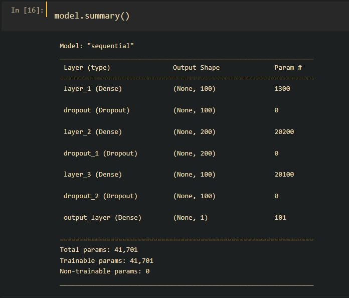

## Cat and Dog Audio Classification

This is my attempt to learn machine learning with audio data which is kinda uncharted territory to me.

**Dataset**: https://www.kaggle.com/mmoreaux/audio-cats-and-dogs

**Method**: Apply **MFCC** (Mel-frequency cepstral coefficients) to the audio data to extract better representation of audio data perception wise. Implement binary classification deep learning with dropout to produce output.

**Result**: 

After 300 epochs:
Training: **87.05%** 	
Validation: **90.48%**

**Lessons learned**:

1. MFCC is one of the best way to extract audio data.
2. For binary classification, use `sigmoid` as the last activation function and use `binary_crossentropy` for loss function.
3. For multi-class classification, use `softmax` as the last activation function and use `categorical_crossentropy` for loss function.
4. Dropout can prevent overfitting on the training data as it randomly choose which neuron to use each epoch.